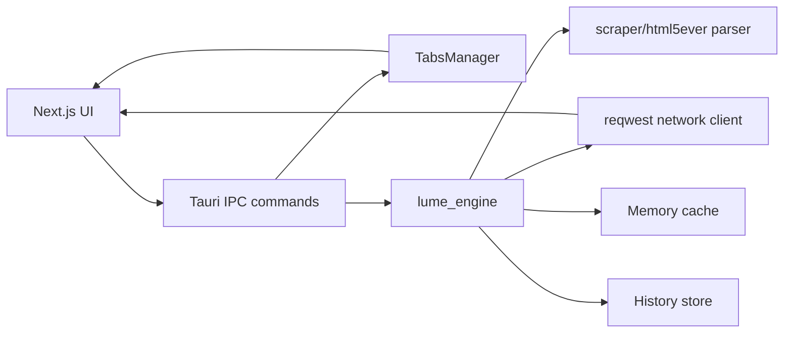

# Lume Architecture

Lume is organized around five deliverables that share one Rust browser core.

## 1. Windows App

- Owner path: `apps/windows`
- Runtime shell: `src-tauri`
- Tauri config overlay: `src-tauri/tauri.windows.conf.json`
- Native surface: frameless WebView2 window, custom titlebar, NSIS/MSI bundles.

## 2. macOS App

- Owner path: `apps/macos`
- Runtime shell: `src-tauri`
- Tauri config overlay: `src-tauri/tauri.macos.conf.json`
- Native surface: frameless WKWebView window, custom titlebar, app/dmg bundles.

## 3. Android App

- Owner path: `apps/android`
- Runtime shell: generated by `npm run tauri:android:init`
- Tauri config overlay: `src-tauri/tauri.android.conf.json`
- Native surface: touch-first shell backed by the shared Rust engine.

## 4. iOS App

- Owner path: `apps/ios`
- Runtime shell: generated by `npm run tauri:ios:init`
- Tauri config overlay: `src-tauri/tauri.ios.conf.json`
- Native surface: touch-first shell backed by the shared Rust engine.

## 5. Browser Engine

- Owner path: `crates/lume_engine`
- Responsibilities:
  - navigation resolution from user input to URL/search/internal targets
  - network fetch preview through `reqwest`
  - HTML parsing through `scraper`, backed by Servo `html5ever`
  - document snapshots with title, description, links, text preview, and resource counts
  - in-memory document cache
  - in-memory browsing history
  - navigation safety policy for blocked schemes

The engine is platform independent. Platform apps own packaging, native window behavior,
permissions, and store-specific integration.

## Current Data Flow

## Packaging Outputs

- Windows x86_64 installers: `apps/windows/installers/x86_64`
- Windows ARM64 installers: `apps/windows/installers/arm64`
- Android APK/AAB artifacts: `apps/android/installers`
- macOS Intel DMG artifacts: `apps/macos/installers/intel`
- macOS Apple Silicon DMG artifacts: `apps/macos/installers/apple-silicon`
- iOS IPA artifacts: `apps/ios/installers`

See `PACKAGING.md` for commands and current platform constraints.
